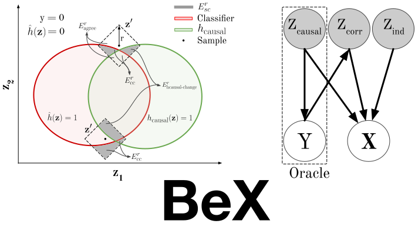

# A Benchmark For Counterfactual Explainers

[](https://opensource.org/licenses/Apache-2.0) 

>Explainability methods have been widely used to interpret and understand the decisions made by classifiers in order to facilitate their adoption in high-stakes applications across various domains within the industry. Counterfactual explanation methods aim to improve our understanding of a model by perturbing samples in a way that would alter its response in an unexpected manner. This information is helpful for users and for machine learning practitioners to understand and improve their models. Given the value provided by counterfactual explanations, there is a growing interest in the research community to investigate and propose new methods. However, we identify two issues that could hinder the progress in this field. (1) With each  method, the authors propose a different evaluation metric to compare with previous literature, thus there is no consensus on what a good counterfactual explanation method is. (2) Such comparisons are usually performed with datasets like CelebA, where images are annotated with attributes that do not fully describe them and with subjective attributes such as "Attractive". In this work, we address these problems by proposing a benchmark with a principled metric to evaluate and compare different counterfactual explanation methods. The benchmark is based on a synthetic dataset where images are fully described by their annotated attributes. As a result, we are able to perform a fair comparison of multiple explainability methods in the recent literature, obtaining insights about their performance. We will make the benchmark public for the benefit of the research community.


## Description 

Code repository for the Bex explainability benchmark. Models and datasets that comprise the benchmark can be found [here](https://zenodo.org/record/6616598). They are 
automatically downloaded when the benchmark is ran.


## Installation

The recommended way to install Bex is via [PyPI](https://pypi.org/project/bex/).

```bash
pip install bex
```


## Usage
We provide a set of counterfactuals explainers already implemented in the benchmark:

1. [Beyond Trivial Counterfactual Explanations with Diverse Valuable Explanations](https://arxiv.org/abs/2103.10226) (DiVE)
2. [xGEMs: Generating Examplars to Explain Black-Box Models](https://arxiv.org/abs/1806.08867) (xGEM)
3. [Latent-CF: A Simple Baseline for Reverse Counterfactual Explanations](https://arxiv.org/abs/2012.09301) (Latent-CF)
4. [Explaining in Style: Training a GAN to explain a classifier in StyleSpace](https://arxiv.org/abs/2104.13369) (StylEx)
5. [Explaining Machine Learning Classifiers through Diverse Counterfactual Explanations](https://arxiv.org/abs/1905.07697) (DiCE)
6. [Inverse Classification for Comparison-based Interpretability in Machine Learning](https://arxiv.org/abs/1712.08443) (Growing Spheres)
7. An oracle with access to the correlated and causal attributes (IS)


The benchmark includes different setting by modifying the number of correlated
`n_corr` attributes and their level of correlation `corr_level`. Right now there are 4 settings available:

* `n_corr=10`, `corr_level=0.95` (default)
* `n_corr=6`, `corr_level=0.95` 
* `n_corr=10`, `corr_level=0.5` 
* `n_corr=6`, `corr_level=0.5`


### Evaluating one of the predefined explainers

```python
import bex
bn = bex.Benchmark(n_corr=6, corr_level=0.95) # downloads necessary files
bn.run("stylex") # or any of: "dive", "xgem", "lcf", "dice", "gs", "IS" (Oracle)
print(bn.summarize()) # get the explainer's performance
```


### Evaluate a custom explainer

You can evaluate your own explainer like so:

```python
import random
import bex

class DummyExplainer(bex.explainers.ExplainerBase):

    def __init__(self, num_explanations):
        super().__init__()
        self.num_explanations = num_explanations

    # This function describes the behaviour of the custom explainer for a given batch
    def explain_batch(self, latents: torch.Tensor, logits: torch.Tensor, 
                      images: torch.Tensor, classifier: torch.nn.Module, 
                      generator: Callable[[torch.Tensor], torch.Tensor]) -> torch.Tensor:

        b, c = latents.size()
        # we will produce self.num_explanations counterfactuals per sample
        z = latents[:, None, :].repeat(1, self.num_explanations, 1)
        z_perturbed = z + random.random() # create counterfactuals z'

        return z_perturbed.view(b, self.num_explanations, c)

bn = bex.Benchmark()
bn.run(DummyExplainer, num_explanations=10)
print(bn.summarize()) # get the explainer's performance
```
## Contact 

For any bug or feature requests, please create an issue.
